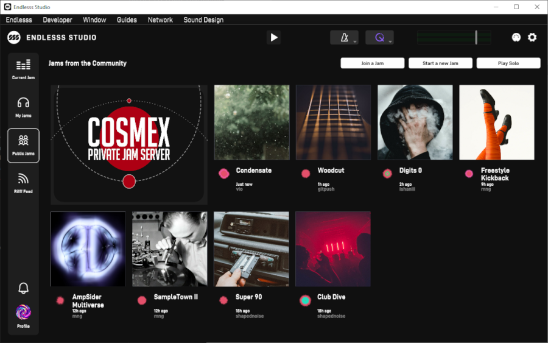
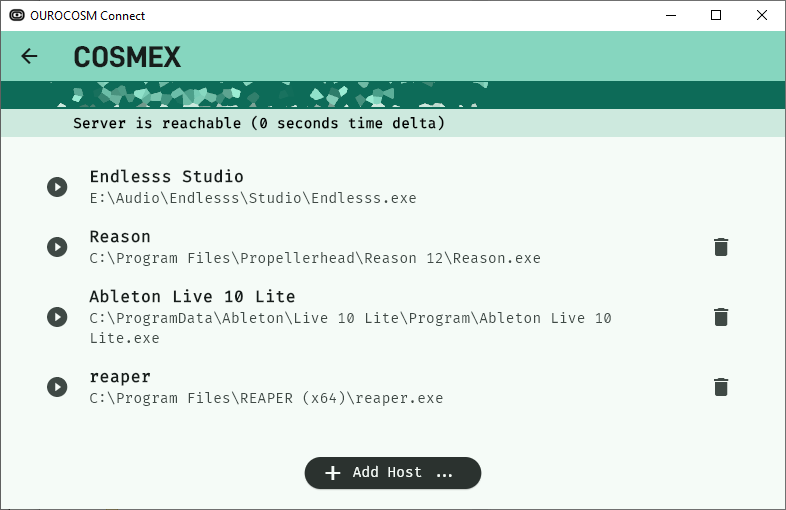

An early, scrappy, proof-of-concept toolset to run your own private Endlesss server for multiplayer musical jamming.

---

**Naturally, this project is not endorsed or sponsored by Endlesss Ltd. Do they even legally exist anymore? Regardless: Use responsibly, at your own risk.**

---

## Purpose

With the closure of *Endlesss Ltd.* in May 2024, the [collaborative music tool](https://web.archive.org/web/20201101012543/http://endlesss.fm/) they had created over the previous 6 years became inoperable, cut off from the cloud services. A community that had sprung up around the *Endlesss* tools and workflow were not satisfied with such a bleak and final outcome for what was, for many of us, a vital piece of creative software. 

**OUROCOSM** ensures that *Endlesss* lives up to its name, providing an open-source self-hosting solution that will work with unmodified *Endlesss Studio* client software, forever.

 

## Abilities

While still early in development, OUROCOSM has proven to be fairly capable; a popular *Endlesss* community has been successfully running their own private server with 50+ registered users, over 10k riffs, jamming regularly and reliably for over a month at time of writing.

**OUROCOSM** builds upon the considerable work done on the [**OUROVEON** toolset](https://github.com/Unbundlesss/OUROVEON), a set of deep archival and live broadcast tools written to expand Endlesss' powers. We've been poking at *Endlesss* and its unpublished endpoints for years.

 

## Function

This project provides guidance and custom tools to provision a self-contained *Endlesss*-compatible suite of services as well as a client-side tool that makes applying the non-invasive patches required to get *Endlesss Studio* talking to our own servers.

Reasons why you might want to do such a thing:

* **You want to jam with your friends again!** It sucks when companies explode and all their closed-source cloud-only tools stop working.

* **You want control over your jams and your data.** Endlesss Ltd. shutting down locked out hundreds of users from years of their creations with a single week's warning. Running your own server ensures you own and control your data - and **OUROCOSM** has great support for exporting directly into [OUROVEON **LORE**](https://github.com/Unbundlesss/OUROVEON/blob/main/doc/LORE.MD) for completely offline browsing and long-term archival.

* You want to use Endlesss in a live performance setting where internet may be spotty or absent entirely - ideally we can provision an **OUROCOSM** server on a low-power device such as a *Raspberry Pi* and have a roving, cloud-free way to do 'local jamming'

* It's 2077 and you're a renegade music archeologist looking for insights into 2020-era collaborative improvisation, back before AI just made all the music for you.

 

# State & Roadmap

### ocConnect
To connect to private servers, we modify the execution environment of a launched application to redirect *Endlesss'* code. `ocConnect` offers a simple, shiny UI to let users pick custom servers, add hosts (eg. other DAWs to host the *Endlesss VST*) and boot the connection. It is written in [Flutter](https://flutter.dev/) and runs on Windows and MacOS.

- [x] MacOS (notarised) and Windows builds
- [x] Data-driven, multi-server support
- [x] Continuous server reachability and time-sync readings
- [x] Support for launching *Endlesss Studio* or any other suitable plugin host with private server binding
- [ ] "One Click" support for erasing `local` Endlesss session data to support switching between servers
- [ ] Quake-style central master-server hosting of private server listings vs. app-bundled server data

### ocServer
Out of the three core cloud services Endlesss relies upon - a CouchDB instance, an S3 store and a custom API server - `ocServer` provides the latter, a web server that handles a portion of the full *Endlesss* API, enough to get back to jamming. It also offers built-in tools for managing **OUROCOSM** servers, such as exporting jam backups, adding new jams, etc. It is written in [Go](https://golang.org/) and therefore will run on basically anything.

- [x] API: auth/login flow
- [x] API: public jam manifests, front-page broadcast
- [x] API: private jam manifests
- [x] API: profile view
- [ ] API: profile edit (partial)
- [ ] API: sample sound pack persistence
- [ ] API: joining / leaving jams
- [ ] API: riff deletion capability
- [ ] Tool: provision CouchDB instance from scratch
- [x] Tool: create new jams on demand
- [x] Tool: create new users on demand
- [x] Tool: export jam to LORE archival format (metadata + stems)
- [ ] Tool: export of personal jams
- [ ] Tool: automatic export and upload with private/personal jam permissions logistics

We have also not yet designed the process for opening up jam and user creation to private groups, eg. via a web interface.

---

 

# Limitations

Due to iOS security, we cannot current patch the environment to make the mobile version of *Endlesss* talk to other servers. I don't anticipate this being possible without jail-breaking.

---

 

# Building & Setup

Full documentation for a from-scratch server setup is ongoing, alongside additions to the `ocServer` tools to make this more streamlined. Documentation will arrive in [INFRA.md](INFRA.md)
